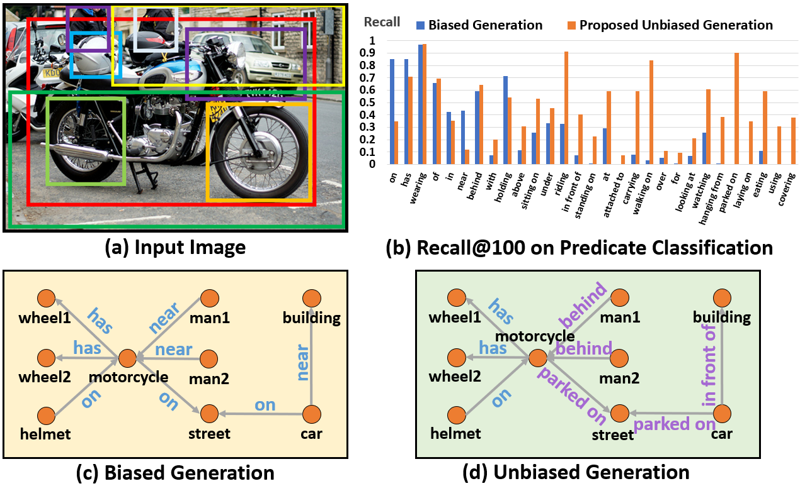
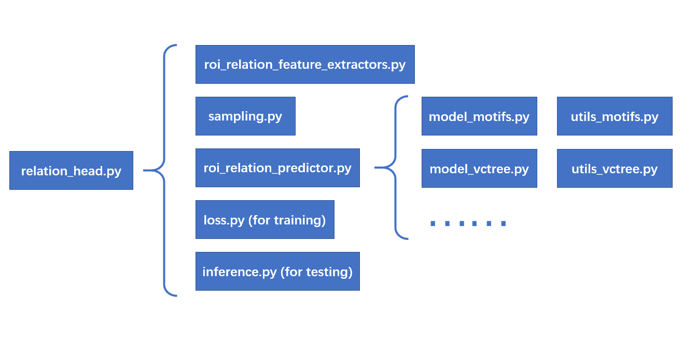

# Scene Graph Benchmark in Pytorch

[](https://github.com/KaihuaTang/Scene-Graph-Benchmark.pytorch/blob/master/LICENSE)
[](https://www.python.org/)


Our paper [Unbiased Scene Graph Generation from Biased Training](https://arxiv.org/abs/2002.11949) has been accepted by CVPR 2020 (Oral).

## Recent Updates

- [x] 2020.06.23 Add no graph constraint mean Recall@K (ng-mR@K) and no graph constraint Zero-Shot Recall@K (ng-zR@K) [\[link\]](METRICS.md#explanation-of-our-metrics)
- [x] 2020.06.23 Allow scene graph detection (SGDet) on custom images [\[link\]](#SGDet-on-custom-images)
- [x] 2020.07.21 Change scene graph detection output on custom images to json files [\[link\]](#SGDet-on-custom-images)
- [x] 2020.07.21 Visualize detected scene graphs of custom images [\[link\]](#Visualize-Detected-SGs-of-Custom-Images)
- [ ] TODO: Using [Background-Exempted Inference](https://github.com/KaihuaTang/Long-Tailed-Recognition.pytorch/tree/master/lvis1.0#background-exempted-inference) to improve the quality of TDE Scene Graph

## Contents

1. [Overview](#Overview)
2. [Install the Requirements](INSTALL.md)
3. [Prepare the Dataset](DATASET.md)
4. [Metrics and Results for our Toolkit](METRICS.md)
    - [Explanation of R@K, mR@K, zR@K, ng-R@K, ng-mR@K, ng-zR@K, A@K, S2G](METRICS.md#explanation-of-our-metrics)
    - [Output Format](METRICS.md#output-format-of-our-code)
    - [Reported Results](METRICS.md#reported-results)
5. [Faster R-CNN Pre-training](#pretrained-models)
6. [Scene Graph Generation as RoI_Head](#scene-graph-generation-as-RoI_Head)
7. [Training on Scene Graph Generation](#perform-training-on-scene-graph-generation)
8. [Evaluation on Scene Graph Generation](#Evaluation)
9. [**Detect Scene Graphs on Your Custom Images** :star2:](#SGDet-on-custom-images)
10. [**Visualize Detected Scene Graphs of Custom Images** :star2:](#Visualize-Detected-SGs-of-Custom-Images)
11. [Other Options that May Improve the SGG](#other-options-that-may-improve-the-SGG)
12. [Tips and Tricks for TDE on any Unbiased Task](#tips-and-Tricks-for-any-unbiased-taskX-from-biased-training)
13. [Frequently Asked Questions](#frequently-asked-questions)
14. [Citations](#Citations)

## Overview

This project aims to build a new CODEBASE of Scene Graph Generation (SGG), and it is also a Pytorch implementation of the paper [Unbiased Scene Graph Generation from Biased Training](https://arxiv.org/abs/2002.11949). The previous widely adopted SGG codebase [neural-motifs](https://github.com/rowanz/neural-motifs) is detached from the recent development of Faster/Mask R-CNN. Therefore, I decided to build a scene graph benchmark on top of the well-known [maskrcnn-benchmark](https://github.com/facebookresearch/maskrcnn-benchmark) project and define relationship prediction as an additional roi_head. By the way, thanks to their elegant framework, this codebase is much more novice-friendly and easier to read/modify for your own projects than previous neural-motifs framework(at least I hope so). It is a pity that when I was working on this project, the [detectron2](https://github.com/facebookresearch/detectron2) had not been released, but I think we can consider [maskrcnn-benchmark](https://github.com/facebookresearch/maskrcnn-benchmark) as a more stable version with less bugs, hahahaha. I also introduce all the old and new metrics used in SGG, and clarify two common misunderstandings in SGG metrics in [METRICS.md](METRICS.md), which cause abnormal results in some papers.

### Benefit from the up-to-date Faster R-CNN in [maskrcnn-benchmark](https://github.com/facebookresearch/maskrcnn-benchmark), this codebase achieves new state-of-the-art Recall@k on SGCls & SGGen (by 2020.2.16) through the reimplemented VCTree using two 1080ti GPUs and batch size 8:

Models | SGGen R@20 | SGGen R@50 | SGGen R@100 | SGCls R@20 | SGCls R@50 | SGCls R@100 | PredCls R@20 | PredCls R@50 | PredCls R@100
-- | -- | -- | -- | -- | -- | -- | -- | -- | -- 
VCTree | 24.53 | 31.93 | 36.21 | 42.77 | 46.67 | 47.64 | 59.02 | 65.42 | 67.18

Note that all results of VCTree should be better than what we reported in [Unbiased Scene Graph Generation from Biased Training](https://arxiv.org/abs/2002.11949), because we optimized the tree construction network after the publication.

### The illustration of the Unbiased SGG from 'Unbiased Scene Graph Generation from Biased Training'



## Installation

Check [INSTALL.md](INSTALL.md) for installation instructions.

## Dataset

Check [DATASET.md](DATASET.md) for instructions of dataset preprocessing.

## Metrics and Results **(IMPORTANT)**
Explanation of metrics in our toolkit and reported results are given in [METRICS.md](METRICS.md)

## Pretrained Models

Since we tested many SGG models in our paper [Unbiased Scene Graph Generation from Biased Training](https://arxiv.org/abs/2002.11949), I won't upload all the pretrained SGG models here. However, you can download the [pretrained Faster R-CNN](https://onedrive.live.com/embed?cid=22376FFAD72C4B64&resid=22376FFAD72C4B64%21779870&authkey=AH5CPVb9g5E67iQ) we used in the paper, which is the most time consuming step in the whole training process (it took 4 2080ti GPUs). As to the SGG model, you can follow the rest instructions to train your own, which only takes 2 GPUs to train each SGG model. The results should be very close to the reported results given in [METRICS.md](METRICS.md)

After you download the [Faster R-CNN model](https://onedrive.live.com/embed?cid=22376FFAD72C4B64&resid=22376FFAD72C4B64%21779870&authkey=AH5CPVb9g5E67iQ), please extract all the files to the directory `/home/username/checkpoints/pretrained_faster_rcnn`. To train your own Faster R-CNN model, please follow the next section.

The above pretrained Faster R-CNN model achives 38.52/26.35/28.14 mAp on VG train/val/test set respectively.

## Faster R-CNN pre-training
The following command can be used to train your own Faster R-CNN model:
```bash
CUDA_VISIBLE_DEVICES=0,1,2,3 python -m torch.distributed.launch --master_port 10001 --nproc_per_node=4 tools/detector_pretrain_net.py --config-file "configs/e2e_relation_detector_X_101_32_8_FPN_1x.yaml" SOLVER.IMS_PER_BATCH 8 TEST.IMS_PER_BATCH 4 DTYPE "float16" SOLVER.MAX_ITER 50000 SOLVER.STEPS "(30000, 45000)" SOLVER.VAL_PERIOD 2000 SOLVER.CHECKPOINT_PERIOD 2000 MODEL.RELATION_ON False OUTPUT_DIR /home/kaihua/checkpoints/pretrained_faster_rcnn SOLVER.PRE_VAL False
```
where ```CUDA_VISIBLE_DEVICES``` and ```--nproc_per_node``` represent the id of GPUs and number of GPUs you use, ```--config-file``` means the config we use, where you can change other parameters. ```SOLVER.IMS_PER_BATCH``` and ```TEST.IMS_PER_BATCH``` are the training and testing batch size respectively, ```DTYPE "float16"``` enables Automatic Mixed Precision supported by [APEX](https://github.com/NVIDIA/apex), ```SOLVER.MAX_ITER``` is the maximum iteration, ```SOLVER.STEPS``` is the steps where we decay the learning rate, ```SOLVER.VAL_PERIOD``` and ```SOLVER.CHECKPOINT_PERIOD``` are the periods of conducting val and saving checkpoint, ```MODEL.RELATION_ON``` means turning on the relationship head or not (since this is the pretraining phase for Faster R-CNN only, we turn off the relationship head),  ```OUTPUT_DIR``` is the output directory to save checkpoints and log (considering `/home/username/checkpoints/pretrained_faster_rcnn`), ```SOLVER.PRE_VAL``` means whether we conduct validation before training or not.


## Scene Graph Generation as RoI_Head

To standardize the SGG, I define scene graph generation as an RoI_Head. Referring to the design of other roi_heads like box_head, I put most of the SGG codes under ```maskrcnn_benchmark/modeling/roi_heads/relation_head``` and their calling sequence is as follows:




## Perform training on Scene Graph Generation

There are **three standard protocols**: (1) Predicate Classification (PredCls): taking ground truth bounding boxes and labels as inputs, (2) Scene Graph Classification (SGCls) : using ground truth bounding boxes without labels, (3) Scene Graph Detection (SGDet): detecting SGs from scratch. We use two switches ```MODEL.ROI_RELATION_HEAD.USE_GT_BOX``` and ```MODEL.ROI_RELATION_HEAD.USE_GT_OBJECT_LABEL``` to select the protocols. 

For **Predicate Classification (PredCls)**, we need to set:
``` bash
MODEL.ROI_RELATION_HEAD.USE_GT_BOX True MODEL.ROI_RELATION_HEAD.USE_GT_OBJECT_LABEL True
```
For **Scene Graph Classification (SGCls)**:
``` bash
MODEL.ROI_RELATION_HEAD.USE_GT_BOX True MODEL.ROI_RELATION_HEAD.USE_GT_OBJECT_LABEL False
```
For **Scene Graph Detection (SGDet)**:
``` bash
MODEL.ROI_RELATION_HEAD.USE_GT_BOX False MODEL.ROI_RELATION_HEAD.USE_GT_OBJECT_LABEL False
```

### Predefined Models
We abstract various SGG models to be different ```relation-head predictors``` in the file ```roi_heads/relation_head/roi_relation_predictors.py```, which are independent of the Faster R-CNN backbone and relation-head feature extractor. To select our predefined models, you can use ```MODEL.ROI_RELATION_HEAD.PREDICTOR```.

For [Neural-MOTIFS](https://arxiv.org/abs/1711.06640) Model:
```bash
MODEL.ROI_RELATION_HEAD.PREDICTOR MotifPredictor
```
For [Iterative-Message-Passing(IMP)](https://arxiv.org/abs/1701.02426) Model (Note that SOLVER.BASE_LR should be changed to 0.001 in SGCls, or the model won't converge):
```bash
MODEL.ROI_RELATION_HEAD.PREDICTOR IMPPredictor
```
For [VCTree](https://arxiv.org/abs/1812.01880) Model:
```bash
MODEL.ROI_RELATION_HEAD.PREDICTOR VCTreePredictor
```
For our predefined Transformer Model (Note that Transformer Model needs to change SOLVER.BASE_LR to 0.001, SOLVER.SCHEDULE.TYPE to WarmupMultiStepLR, SOLVER.MAX_ITER to 16000, SOLVER.IMS_PER_BATCH to 16, SOLVER.STEPS to (10000, 16000).), which is provided by [Jiaxin Shi](https://github.com/shijx12):
```bash
MODEL.ROI_RELATION_HEAD.PREDICTOR TransformerPredictor
```
For [Unbiased-Causal-TDE](https://arxiv.org/abs/2002.11949) Model:
```bash
MODEL.ROI_RELATION_HEAD.PREDICTOR CausalAnalysisPredictor
```

The default settings are under ```configs/e2e_relation_X_101_32_8_FPN_1x.yaml``` and ```maskrcnn_benchmark/config/defaults.py```. The priority is ```command > yaml > defaults.py```

### Customize Your Own Model
If you want to customize your own model, you can refer ```maskrcnn-benchmark/modeling/roi_heads/relation_head/model_XXXXX.py``` and ```maskrcnn-benchmark/modeling/roi_heads/relation_head/utils_XXXXX.py```. You also need to add corresponding nn.Module in ```maskrcnn-benchmark/modeling/roi_heads/relation_head/roi_relation_predictors.py```. Sometimes you may also need to change the inputs & outputs of the module through ```maskrcnn-benchmark/modeling/roi_heads/relation_head/relation_head.py```.

### The proposed Causal TDE on [Unbiased Scene Graph Generation from Biased Training](https://arxiv.org/abs/2002.11949)
As to the Unbiased-Causal-TDE, there are some additional parameters you need to know. ```MODEL.ROI_RELATION_HEAD.CAUSAL.EFFECT_TYPE``` is used to select the causal effect analysis type during inference(test), where "none" is original likelihood, "TDE" is total direct effect, "NIE" is natural indirect effect, "TE" is total effect. ```MODEL.ROI_RELATION_HEAD.CAUSAL.FUSION_TYPE``` has two choice "sum" or "gate". Since Unbiased Causal TDE Analysis is model-agnostic, we support [Neural-MOTIFS](https://arxiv.org/abs/1711.06640), [VCTree](https://arxiv.org/abs/1812.01880) and [VTransE](https://arxiv.org/abs/1702.08319). ```MODEL.ROI_RELATION_HEAD.CAUSAL.CONTEXT_LAYER``` is used to select these models for Unbiased Causal Analysis, which has three choices: motifs, vctree, vtranse.

Note that during training, we always set ```MODEL.ROI_RELATION_HEAD.CAUSAL.EFFECT_TYPE``` to be 'none', because causal effect analysis is only applicable to the inference/test phase.

### Examples of the Training Command
Training Example 1 : (PreCls, Motif Model)
```bash
CUDA_VISIBLE_DEVICES=0,1 python -m torch.distributed.launch --master_port 10025 --nproc_per_node=2 tools/relation_train_net.py --config-file "configs/e2e_relation_X_101_32_8_FPN_1x.yaml" MODEL.ROI_RELATION_HEAD.USE_GT_BOX True MODEL.ROI_RELATION_HEAD.USE_GT_OBJECT_LABEL True MODEL.ROI_RELATION_HEAD.PREDICTOR MotifPredictor SOLVER.IMS_PER_BATCH 12 TEST.IMS_PER_BATCH 2 DTYPE "float16" SOLVER.MAX_ITER 50000 SOLVER.VAL_PERIOD 2000 SOLVER.CHECKPOINT_PERIOD 2000 GLOVE_DIR /home/kaihua/glove MODEL.PRETRAINED_DETECTOR_CKPT /home/kaihua/checkpoints/pretrained_faster_rcnn/model_final.pth OUTPUT_DIR /home/kaihua/checkpoints/motif-precls-exmp
```
where ```GLOVE_DIR``` is the directory used to save glove initializations, ```MODEL.PRETRAINED_DETECTOR_CKPT``` is the pretrained Faster R-CNN model you want to load, ```OUTPUT_DIR``` is the output directory used to save checkpoints and the log. Since we use the ```WarmupReduceLROnPlateau``` as the learning scheduler for SGG, ```SOLVER.STEPS``` is not required anymore.

Training Example 2 : (SGCls, Causal, **TDE**, SUM Fusion, MOTIFS Model)
```bash
CUDA_VISIBLE_DEVICES=0,1 python -m torch.distributed.launch --master_port 10026 --nproc_per_node=2 tools/relation_train_net.py --config-file "configs/e2e_relation_X_101_32_8_FPN_1x.yaml" MODEL.ROI_RELATION_HEAD.USE_GT_BOX True MODEL.ROI_RELATION_HEAD.USE_GT_OBJECT_LABEL False MODEL.ROI_RELATION_HEAD.PREDICTOR CausalAnalysisPredictor MODEL.ROI_RELATION_HEAD.CAUSAL.EFFECT_TYPE none MODEL.ROI_RELATION_HEAD.CAUSAL.FUSION_TYPE sum MODEL.ROI_RELATION_HEAD.CAUSAL.CONTEXT_LAYER motifs  SOLVER.IMS_PER_BATCH 12 TEST.IMS_PER_BATCH 2 DTYPE "float16" SOLVER.MAX_ITER 50000 SOLVER.VAL_PERIOD 2000 SOLVER.CHECKPOINT_PERIOD 2000 GLOVE_DIR /home/kaihua/glove MODEL.PRETRAINED_DETECTOR_CKPT /home/kaihua/checkpoints/pretrained_faster_rcnn/model_final.pth OUTPUT_DIR /home/kaihua/checkpoints/causal-motifs-sgcls-exmp
```


## Evaluation

### Examples of the Test Command
Test Example 1 : (PreCls, Motif Model)
```bash
CUDA_VISIBLE_DEVICES=0 python -m torch.distributed.launch --master_port 10027 --nproc_per_node=1 tools/relation_test_net.py --config-file "configs/e2e_relation_X_101_32_8_FPN_1x.yaml" MODEL.ROI_RELATION_HEAD.USE_GT_BOX True MODEL.ROI_RELATION_HEAD.USE_GT_OBJECT_LABEL True MODEL.ROI_RELATION_HEAD.PREDICTOR MotifPredictor TEST.IMS_PER_BATCH 1 DTYPE "float16" GLOVE_DIR /home/kaihua/glove MODEL.PRETRAINED_DETECTOR_CKPT /home/kaihua/checkpoints/motif-precls-exmp OUTPUT_DIR /home/kaihua/checkpoints/motif-precls-exmp
```

Test Example 2 : (SGCls, Causal, **TDE**, SUM Fusion, MOTIFS Model)
```bash
CUDA_VISIBLE_DEVICES=0 python -m torch.distributed.launch --master_port 10028 --nproc_per_node=1 tools/relation_test_net.py --config-file "configs/e2e_relation_X_101_32_8_FPN_1x.yaml" MODEL.ROI_RELATION_HEAD.USE_GT_BOX True MODEL.ROI_RELATION_HEAD.USE_GT_OBJECT_LABEL False MODEL.ROI_RELATION_HEAD.PREDICTOR CausalAnalysisPredictor MODEL.ROI_RELATION_HEAD.CAUSAL.EFFECT_TYPE TDE MODEL.ROI_RELATION_HEAD.CAUSAL.FUSION_TYPE sum MODEL.ROI_RELATION_HEAD.CAUSAL.CONTEXT_LAYER motifs  TEST.IMS_PER_BATCH 1 DTYPE "float16" GLOVE_DIR /home/kaihua/glove MODEL.PRETRAINED_DETECTOR_CKPT /home/kaihua/checkpoints/causal-motifs-sgcls-exmp OUTPUT_DIR /home/kaihua/checkpoints/causal-motifs-sgcls-exmp
```

### Examples of Pretrained Causal MOTIFS-SUM models
Examples of Pretrained Causal MOTIFS-SUM models on SGDet/SGCls/PredCls (batch size 12): [(SGDet Download)](https://onedrive.live.com/embed?cid=22376FFAD72C4B64&resid=22376FFAD72C4B64%21781947&authkey=AF_EM-rkbMyT3gs), [(SGCls Download)](https://onedrive.live.com/embed?cid=22376FFAD72C4B64&resid=22376FFAD72C4B64%21781938&authkey=AO_ddcgNpVVGE-g), [(PredCls Download)](https://onedrive.live.com/embed?cid=22376FFAD72C4B64&resid=22376FFAD72C4B64%21781937&authkey=AOzowl5-07RzJz4)

Corresponding Results (The original models used in the paper are lost. These are the fresh ones, so there are some fluctuations on the results. More results can be found in [Reported Results](METRICS.md#reported-results)):

Models |  R@20 | R@50 | R@100 | mR@20 | mR@50 | mR@100 | zR@20 | zR@50 | zR@100
-- | -- | -- | -- | -- | -- | -- | -- | -- | -- 
MOTIFS-SGDet-none   | 25.42 | 32.45 | 37.26 | 4.36 | 5.83 | 7.08 | 0.02 | 0.08 | 0.24
MOTIFS-SGDet-TDE    | 11.92 | 16.56 | 20.15 | 6.58 | 8.94 | 10.99 | 1.54 | 2.33 | 3.03
MOTIFS-SGCls-none   | 36.02 | 39.25 | 40.07 | 6.50 | 8.02 | 8.51 | 1.06 | 2.18 | 3.07
MOTIFS-SGCls-TDE    | 20.47 | 26.31 | 28.79 | 9.80 | 13.21 | 15.06 | 1.91 | 2.95 | 4.10
MOTIFS-PredCls-none | 59.64 | 66.11 | 67.96 | 11.46 | 14.60 | 15.84 | 5.79 | 11.02 | 14.74
MOTIFS-PredCls-TDE  | 33.38 | 45.88 | 51.25 | 17.85 | 24.75 | 28.70 | 8.28 | 14.31 | 18.04

## SGDet on Custom Images
Note that evaluation on custum images is only applicable for SGDet model, because PredCls and SGCls model requires additional ground-truth bounding boxes information. To detect scene graphs into a json file on your own images, you need to turn on the switch TEST.CUSTUM_EVAL and give a folder path that contains the custom images to TEST.CUSTUM_PATH. Only JPG files are allowed. The output will be saved as custom_prediction.json in the given DETECTED_SGG_DIR.

Test Example 1 : (SGDet, **Causal TDE**, MOTIFS Model, SUM Fusion) [(checkpoint)](https://onedrive.live.com/embed?cid=22376FFAD72C4B64&resid=22376FFAD72C4B64%21781947&authkey=AF_EM-rkbMyT3gs)
```bash
CUDA_VISIBLE_DEVICES=0 python -m torch.distributed.launch --master_port 10027 --nproc_per_node=1 tools/relation_test_net.py --config-file "configs/e2e_relation_X_101_32_8_FPN_1x.yaml" MODEL.ROI_RELATION_HEAD.USE_GT_BOX False MODEL.ROI_RELATION_HEAD.USE_GT_OBJECT_LABEL False MODEL.ROI_RELATION_HEAD.PREDICTOR CausalAnalysisPredictor MODEL.ROI_RELATION_HEAD.CAUSAL.EFFECT_TYPE TDE MODEL.ROI_RELATION_HEAD.CAUSAL.FUSION_TYPE sum MODEL.ROI_RELATION_HEAD.CAUSAL.CONTEXT_LAYER motifs TEST.IMS_PER_BATCH 1 DTYPE "float16" GLOVE_DIR /home/kaihua/glove MODEL.PRETRAINED_DETECTOR_CKPT /home/kaihua/checkpoints/causal-motifs-sgdet OUTPUT_DIR /home/kaihua/checkpoints/causal-motifs-sgdet TEST.CUSTUM_EVAL True TEST.CUSTUM_PATH /home/kaihua/checkpoints/custom_images DETECTED_SGG_DIR /home/kaihua/checkpoints/your_output_path
```

Test Example 2 : (SGDet, **Original**, MOTIFS Model, SUM Fusion) [(same checkpoint)](https://onedrive.live.com/embed?cid=22376FFAD72C4B64&resid=22376FFAD72C4B64%21781947&authkey=AF_EM-rkbMyT3gs)
```bash
CUDA_VISIBLE_DEVICES=0 python -m torch.distributed.launch --master_port 10027 --nproc_per_node=1 tools/relation_test_net.py --config-file "configs/e2e_relation_X_101_32_8_FPN_1x.yaml" MODEL.ROI_RELATION_HEAD.USE_GT_BOX False MODEL.ROI_RELATION_HEAD.USE_GT_OBJECT_LABEL False MODEL.ROI_RELATION_HEAD.PREDICTOR CausalAnalysisPredictor MODEL.ROI_RELATION_HEAD.CAUSAL.EFFECT_TYPE none MODEL.ROI_RELATION_HEAD.CAUSAL.FUSION_TYPE sum MODEL.ROI_RELATION_HEAD.CAUSAL.CONTEXT_LAYER motifs TEST.IMS_PER_BATCH 1 DTYPE "float16" GLOVE_DIR /home/kaihua/glove MODEL.PRETRAINED_DETECTOR_CKPT /home/kaihua/checkpoints/causal-motifs-sgdet OUTPUT_DIR /home/kaihua/checkpoints/causal-motifs-sgdet TEST.CUSTUM_EVAL True TEST.CUSTUM_PATH /home/kaihua/checkpoints/custom_images DETECTED_SGG_DIR /home/kaihua/checkpoints/your_output_path
```

The output is a json file. For each image, the scene graph information is saved as a dictionary containing bbox(sorted), bbox_labels(sorted), bbox_scores(sorted), rel_pairs(sorted), rel_labels(sorted), rel_scores(sorted), rel_all_scores(sorted), where the last rel_all_scores give all 51 predicates probability for each pair of objects. The dataset information is saved as custom_data_info.json in the same DETECTED_SGG_DIR.

## Visualize Detected SGs of Custom Images
To visualize the detected scene graphs of custom images, you can follow the jupyter note: [visualization/3.visualize_custom_SGDet.jpynb](https://github.com/KaihuaTang/Scene-Graph-Benchmark.pytorch/blob/master/visualization/3.visualize_custom_SGDet.ipynb). The inputs of our visualization code are custom_prediction.json and custom_data_info.json in DETECTED_SGG_DIR. They will be automatically generated if you run the above custom SGDet instruction successfully. Note that there may be too much trivial bounding boxes and relationships, so you can select top-k bbox and predicates for better scene graphs by change parameters box_topk and rel_topk. 

## Other Options that May Improve the SGG

- For some models (not all), turning on or turning off ```MODEL.ROI_RELATION_HEAD.POOLING_ALL_LEVELS``` will affect the performance of predicate prediction, e.g., turning it off will improve VCTree PredCls but not the corresponding SGCls and SGGen. For the reported results of VCTree, we simply turn it on for all three protocols like other models.

- For some models (not all), a crazy fusion proposed by [Learning to Count Object](https://arxiv.org/abs/1802.05766) will significantly improves the results, which looks like ```f(x1, x2) = ReLU(x1 + x2) - (x1 - x2)**2```. It can be used to combine the subject and object features in ```roi_heads/relation_head/roi_relation_predictors.py```. For now, most of our model just concatenate them as ```torch.cat((head_rep, tail_rep), dim=-1)```.

- Not to mention the hidden dimensions in the models, e.g., ```MODEL.ROI_RELATION_HEAD.CONTEXT_HIDDEN_DIM```. Due to the limited time, we didn't fully explore all the settings in this project, I won't be surprised if you improve our results by simply changing one of our hyper-parameters

## Tips and Tricks for any Unbiased TaskX from Biased Training

The counterfactual inference is not only applicable to SGG. Actually, my collegue [Yulei](https://github.com/yuleiniu) found that counterfactual causal inference also has significant potential in [unbiased VQA](https://arxiv.org/abs/2006.04315). We believe such an counterfactual inference can also be applied to lots of reasoning tasks with significant bias. It basically just runs the model two times (one for original output, another for the intervened output), and the later one gets the biased prior that should be subtracted from the final prediction. But there are three tips you need to bear in mind:
- The most important things is always the causal graph. You need to find the correct causal graph with an identifiable branch that causes the biased predictions. If the causal graph is incorrect, the rest would be meaningless. Note that causal graph is not the summarization of the existing network (but the guidance to build networks), you should modify your network based on causal graph, but not vise versa. 
- For those nodes having multiple input branches in the causal graph, it's crucial to choose the right fusion function. We tested lots of fusion funtions and only found the SUM fusion and GATE fusion consistently working well. The fusion function like element-wise production won't work for TDE analysis in most of the cases, because the causal influence from multiple branches can not be linearly separated anymore, which means, it's no longer an identifiable 'influence'.
- For those final predictions having multiple input branches in the causal graph, it may also need to add auxiliary losses for each branch to stablize the causal influence of each independent branch. Because when these branches have different convergent speeds, those hard branches would easily be learned as unimportant tiny floatings that depend on the fastest/stablest converged branch. Auxiliary losses allow different branches to have independent and equal influences.

## Frequently Asked Questions:

1. **Q:** Fail to load the given checkpoints.
**A:** The model to be loaded is based on the last_checkpoint file in the OUTPUT_DIR path. If you fail to load the given pretained checkpoints, it probably because the last_checkpoint file still provides the path in my workstation rather than your own path.

2. **Q:** AssertionError on "assert len(fns) == 108073"
**A:** If you are working on VG dataset, it is probably caused by the wrong DATASETS (data path) in maskrcnn_benchmark/config/paths_catlog.py. If you are working on your custom datasets, just comment out the assertions.

3. **Q:** AssertionError on "l_batch == 1" in model_motifs.py
**A:** The original MOTIFS code only supports evaluation on 1 GPU. Since my reimplemented motifs is based on their code, I keep this assertion to make sure it won't cause any unexpected errors.

## Citations

If you find this project helps your research, please kindly consider citing our project or papers in your publications.

```
@misc{tang2020sggcode,
title = {A Scene Graph Generation Codebase in PyTorch},
author = {Tang, Kaihua},
year = {2020},
note = {\url{https://github.com/KaihuaTang/Scene-Graph-Benchmark.pytorch}},
}

@inproceedings{tang2018learning,
  title={Learning to Compose Dynamic Tree Structures for Visual Contexts},
  author={Tang, Kaihua and Zhang, Hanwang and Wu, Baoyuan and Luo, Wenhan and Liu, Wei},
  booktitle= "Conference on Computer Vision and Pattern Recognition",
  year={2019}
}

@inproceedings{tang2020unbiased,
  title={Unbiased Scene Graph Generation from Biased Training},
  author={Tang, Kaihua and Niu, Yulei and Huang, Jianqiang and Shi, Jiaxin and Zhang, Hanwang},
  booktitle= "Conference on Computer Vision and Pattern Recognition",
  year={2020}
}
```
